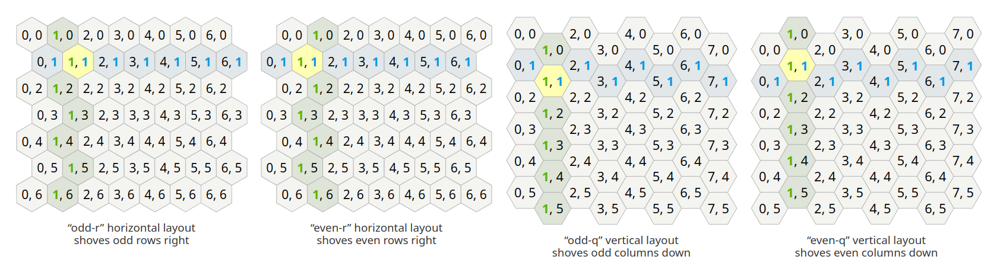
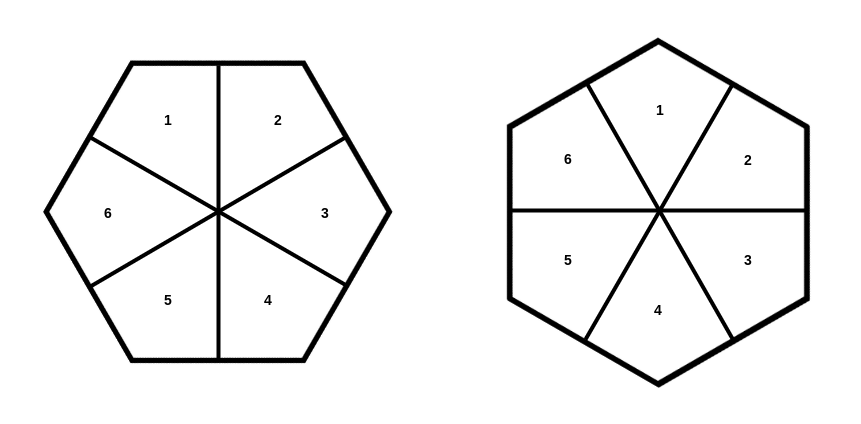
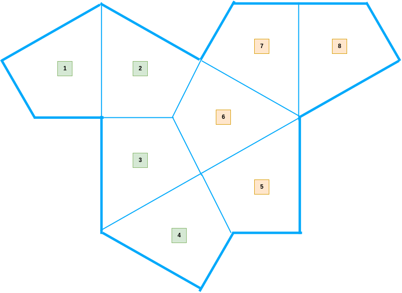
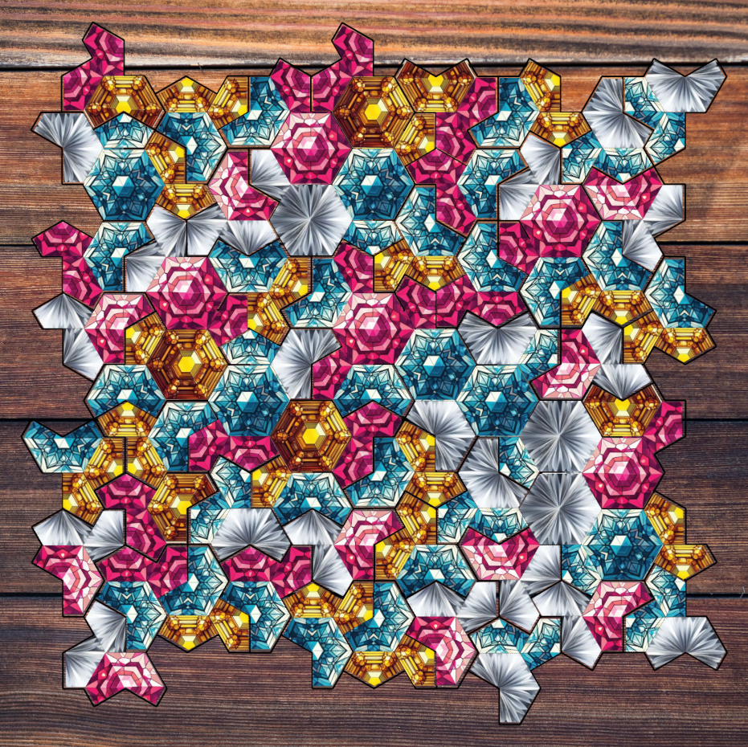

# API Documentation

## Overview

This document provides a comprehensive guide to the API of the Tridecco Game Board library.

## Table of Contents

- [API Documentation](#api-documentation)
  - [Overview](#overview)
  - [Table of Contents](#table-of-contents)
  - [Import the Library](#import-the-library)
    - [Node.js](#nodejs)
    - [Browser](#browser)
  - [Hexagonal Grid](#hexagonal-grid)
    - [Constructor](#constructor)
      - [Example](#example)
    - [`get(col, row)`](#getcol-row)
      - [Example](#example-1)
    - [`set(col, row, value)`](#setcol-row-value)
      - [Example](#example-2)
    - [`remove(col, row)`](#removecol-row)
      - [Example](#example-3)
    - [`getAdjacents(col, row)`](#getadjacentscol-row)
      - [Example](#example-4)
    - [`forEach(callback)`](#foreachcallback)
      - [Example](#example-5)
    - [`clone()`](#clone)
      - [Example](#example-6)
    - [`clear()`](#clear)
      - [Example](#example-7)
  - [Triangular Hexagonal Grid](#triangular-hexagonal-grid)
    - [Constructor](#constructor-1)
      - [Example](#example-8)
    - [`get(col, row, triangle)`](#getcol-row-triangle)
      - [Example](#example-9)
    - [`set(positions, value)`](#setpositions-value)
      - [Example](#example-10)
    - [`remove(positions)`](#removepositions)
      - [Example](#example-11)
    - [`getHexagon(col, row)`](#gethexagoncol-row)
      - [Example](#example-12)
    - [`setHexagon(col, row, values)`](#sethexagoncol-row-values)
      - [Example](#example-13)
    - [`removeHexagon(col, row)`](#removehexagoncol-row)
      - [Example](#example-14)
    - [`isFull(col, row)`](#isfullcol-row)
      - [Example](#example-15)
    - [`clone()`](#clone-1)
      - [Example](#example-16)
  - [Game Board](#game-board)
    - [Constructor](#constructor-2)
      - [Example](#example-17)
    - [`get(index)`](#getindex)
      - [Example](#example-18)
    - [`set(index, value)`](#setindex-value)
      - [Example](#example-19)
    - [`place(index, value)`](#placeindex-value)
      - [Example](#example-20)
    - [`remove(index)`](#removeindex)
      - [Example](#example-21)
    - [`getRelatedHexagons(index)`](#getrelatedhexagonsindex)
      - [Example](#example-22)
    - [`getRandomPosition(isEdge, excludedIndexes)`](#getrandompositionisedge-excludedindexes)
      - [Example](#example-23)
    - [`getEmptyPositions()`](#getemptypositions)
      - [Example](#example-24)
    - [`getOccupiedPositions()`](#getoccupiedpositions)
      - [Example](#example-25)
    - [`getAdjacentPositions()`](#getadjacentpositions)
      - [Example](#example-26)
    - [`getAvailablePositions()`](#getavailablepositions)
      - [Example](#example-27)
    - [`getHexagonPositions(piece)`](#gethexagonpositionspiece)
      - [Example](#example-28)
    - [`countHexagonsFormed(index, piece)`](#counthexagonsformedindex-piece)
      - [Example](#example-29)
    - [`isEmpty(index)`](#isemptyindex)
      - [Example](#example-30)
    - [`isCompleteHexagon(col, row)`](#iscompletehexagoncol-row)
      - [Example](#example-31)
    - [`getCompleteHexagons()`](#getcompletehexagons)
      - [Example](#example-32)
    - [`addEventListener(event, callback)`](#addeventlistenerevent-callback)
      - [Example](#example-33)
    - [`removeEventListener(event, callback)`](#removeeventlistenerevent-callback)
      - [Example](#example-34)
    - [`back(steps)`](#backsteps)
      - [Example](#example-35)
    - [`clear()`](#clear-1)
      - [Example](#example-36)
  - [Game Piece](#game-piece)
    - [Constructor](#constructor-3)
      - [Example](#example-37)
    - [`equals(other)`](#equalsother)
      - [Example](#example-38)
  - [Texture Pack](#texture-pack)
    - [Constructor](#constructor-4)
      - [Example](#example-39)
    - [`get(type, key)`](#gettype-key)
      - [Example](#example-40)
  - [Renderer](#renderer)
    - [Constructor](#constructor-5)
      - [Example](#example-41)
    - [`previewPiece(index, piece, fillColor)`](#previewpieceindex-piece-fillcolor)
      - [Example](#example-42)
    - [`clearPreview()`](#clearpreview)
      - [Example](#example-43)
    - [`showAvailablePositions(positions, fillColor)`](#showavailablepositionspositions-fillcolor)
      - [Example](#example-44)
    - [`clearAvailablePositions()`](#clearavailablepositions)
      - [Example](#example-45)
    - [`getTexture(type, key)`](#gettexturetype-key)
      - [Example](#example-46)
    - [`updateMap(newMap)`](#updatemapnewmap)
      - [Example](#example-47)
    - [`updateTextures(texturesUrl)`](#updatetexturestexturesurl)
      - [Example](#example-48)
    - [`updateBackground(backgroundUrl)`](#updatebackgroundbackgroundurl)
      - [Example](#example-49)
    - [`updateGrid(gridUrl)`](#updategridgridurl)
      - [Example](#example-50)
    - [`addEventListener(eventType, listener, options)`](#addeventlistenereventtype-listener-options)
      - [Example](#example-51)
    - [`removeEventListener(eventType, listener)`](#removeeventlistenereventtype-listener)
      - [Example](#example-52)
    - [`destroy()`](#destroy)
      - [Example](#example-53)

## Import the Library

### Node.js

```javascript
// Import the library
const Tridecco = require('tridecco-board');

// Hexagonal Grid
const { HexGrid } = Tridecco;

// Triangular Hexagonal Grid
const { TriHexGrid } = Tridecco;

// Board
const { Board } = Tridecco;

// Piece
const { Piece } = Tridecco;

// Texture Pack AND Renderer
// Note: TexturePack and Renderer only work in the browser environment

// Maps
const defaultBoardMap = Tridecco.maps.board.default;
const defaultRendererMap = Tridecco.maps.renderer.default;
```

### Browser

```html
<!-- Import the library -->
<script src="https://cdn.jsdelivr.net/npm/tridecco-board@0.2.2/dist/tridecco-board.min.js"></script>
```

```javascript
// Hexagonal Grid
const { HexGrid } = Tridecco;

// Triangular Hexagonal Grid
const { TriHexGrid } = Tridecco;

// Board
const { Board } = Tridecco;

// Piece
const { Piece } = Tridecco;

// Texture Pack
const { TexturePack } = Tridecco;

// Renderer
const { Renderer } = Tridecco;

// Maps
const defaultBoardMap = Tridecco.maps.board.default;
const defaultRendererMap = Tridecco.maps.renderer.default;
```

## Hexagonal Grid



### Constructor

```javascript
constructor(columns, rows, type);
```

**Description:**

Creates a new `HexGrid` instance.

**Parameters:**

- `columns` (number): The number of columns in the grid.
- `rows` (number): The number of rows in the grid.
- `type` (string): The type of hexagonal grid layout. Must be one of the following:
  - `'odd-r'`: Odd-r offset coordinate system.
  - `'even-r'`: Even-r offset coordinate system.
  - `'odd-q'`: Odd-q offset coordinate system.
  - `'even-q'`: Even-q offset coordinate system.

**Throws:**

- `Error`: If the `type` parameter is not one of the valid grid types.

#### Example

```javascript
const grid = new HexGrid(10, 8, 'odd-r');
```

### `get(col, row)`

```javascript
get(col, row);
```

**Description:**

Retrieves the value stored at the specified column and row in the grid.

**Parameters:**

- `col` (number): The column index (0-based).
- `row` (number): The row index (0-based).

**Returns:**

- `* | null`: The value at the specified position, or `null` if the coordinates are out of bounds or the cell is empty.

#### Example

```javascript
const value = grid.get(3, 2);
console.log(value); // Output: null (if nothing is set at this position initially)
```

### `set(col, row, value)`

```javascript
set(col, row, value);
```

**Description:**

Sets a value at the specified column and row in the grid.

**Parameters:**

- `col` (number): The column index (0-based).
- `row` (number): The row index (0-based).
- `value` (\*): The value to be stored at the specified position.

#### Example

```javascript
grid.set(3, 2, 'Tile A');
```

### `remove(col, row)`

```javascript
remove(col, row);
```

**Description:**

Removes the value at the specified column and row in the grid, setting the cell to `null`.

**Parameters:**

- `col` (number): The column index (0-based).
- `row` (number): The row index (0-based).

**Returns:**

- `* | null`: The value that was removed from the specified position, or `null` if the coordinates were out of bounds or the cell was already empty.

#### Example

```javascript
const removedValue = grid.remove(3, 2);
console.log(removedValue); // Output: 'Tile A' (if 'Tile A' was previously set at this position)
console.log(grid.get(3, 2)); // Output: null
```

### `getAdjacents(col, row)`

```javascript
getAdjacents(col, row);
```

**Description:**

Retrieves an array of adjacent hexes for a given column and row. The adjacency is determined based on the grid's `type` (offset coordinate system).

**Parameters:**

- `col` (number): The column index (0-based) of the hex to find neighbors for.
- `row` (number): The row index (0-based) of the hex to find neighbors for.

**Returns:**

- `Array<object>`: An array of adjacent hex objects. Each object in the array has the following properties:
  - `col` (number): The column index of the adjacent hex.
  - `row` (number): The row index of the adjacent hex.
  - `value` (\* | null): The value stored in the adjacent hex, or `null` if the adjacent hex is out of bounds or empty.
    Returns an empty array if no adjacent hexes with values are found within the grid boundaries.

#### Example

```javascript
grid.set(3, 2, 'Center');
grid.set(3, 1, 'North');
grid.set(4, 2, 'East');

const adjacents = grid.getAdjacents(3, 2);
console.log(adjacents);
/* Output (for 'odd-r' type, might vary for other types):
[
  { col: 3, row: 1, value: 'North' },
  { col: 4, row: 2, value: 'East' }
  // ... other adjacent hexes if they have values and are within bounds
]
*/
```

### `forEach(callback)`

```javascript
forEach(callback);
```

**Description:**

Iterates over each cell in the grid and executes a provided callback function for each cell. The callback function is called with the following parameters:

- `value` (\* | null): The value stored in the cell.
- `col` (number): The column index of the cell.
- `row` (number): The row index of the cell.

**Parameters:**

- `callback` (function): A function to execute for each cell in the grid. The function should accept three parameters: `value`, `col`, and `row`.

#### Example

```javascript
grid.set(3, 2, 'Tile A');
grid.set(4, 2, 'Tile B');

grid.forEach((value, col, row) => {
  console.log(`Value at (${col}, ${row}): ${value}`);
});
/* Output:
...
Value at (3, 2): Tile A
Value at (4, 2): Tile B
...
*/
```

### `clone()`

```javascript
clone();
```

**Description:**

Creates a deep copy of the `HexGrid` instance. This means that a new `HexGrid` object is created with the same dimensions, type, and values as the original grid. Changes to the cloned grid will not affect the original grid, and vice versa.

**Returns:**

- `HexGrid`: A new `HexGrid` instance that is a deep copy of the original grid.

#### Example

```javascript
const grid2 = grid.clone();
grid2.set(0, 0, 'New Value in Clone');
console.log(grid.get(0, 0)); // Output: null (original grid is unchanged)
console.log(grid2.get(0, 0)); // Output: 'New Value in Clone' (clone grid has the new value)
```

### `clear()`

```javascript
clear();
```

**Description:**

Clears the entire grid by setting all cell values to `null`. This effectively empties the grid while preserving its dimensions and type.

#### Example

```javascript
grid.clear();
console.log(grid.get(3, 2)); // Output: null (after clearing)
```

## Triangular Hexagonal Grid



### Constructor

```javascript
constructor(columns, rows, type);
```

**Description:**

Creates a new instance of `TriHexGrid`. It extends the `HexGrid` class, so it inherits all the properties and methods of `HexGrid`. It represents a hexagonal grid where each hexagon is divided into six triangles.

**Parameters:**

- `columns` (number): The number of columns in the grid.
- `rows` (number): The number of rows in the grid.
- `type` (string): The type of the grid, inherited from `HexGrid`. Must be one of: 'odd-r', 'even-r', 'odd-q', or 'even-q'.

#### Example

```javascript
const triHexGrid = new TriHexGrid(5, 4, 'odd-r');
```

### `get(col, row, triangle)`

```javascript
get(col, row, triangle);
```

**Description:**

Retrieves the value of a specific triangle within a hexagon at the given column and row.

**Parameters:**

- `col` (number): The column index (0-based).
- `row` (number): The row index (0-based).
- `triangle` (number): The index of the triangle within the hexagon (1-based, from 1 to 6).

**Returns:**

- `* | null`: The value stored in the specified triangle, or `null` if the triangle is empty, the hexagon is out of bounds, or the hexagon has not been initialized.

**Throws:**

- `Error`: If triangle is less than 1 or bigger than 6.

#### Example

```javascript
const value = triHexGrid.get(2, 1, 3); // Get the value of the 3rd triangle in the hexagon at (2, 1)
```

### `set(positions, value)`

```javascript
set(positions, value);
```

**Description:**

Sets the value of multiple triangles within the grid. Each position in the `positions` array specifies a single triangle to be updated.

**Parameters:**

- `positions` (Array\<Array\<number>>): An array of positions. Each position is a three-element array: `[col, row, triangle]`.
  - `col` (number): The column index (0-based).
  - `row` (number): The row index (0-based).
  - `triangle` (number): The index of the triangle within the hexagon (1-based, from 1 to 6).
- `value` (\*): The value to be set for all specified triangles.

**Throws:**

- `Error`: If triangle is less than 1 or bigger than 6.

#### Example

```javascript
triHexGrid.set(
  [
    [0, 0, 1],
    [0, 0, 2],
    [1, 2, 4],
  ],
  'myValue',
); // Set triangles at (0, 0, 1), (0, 0, 2), and (1, 2, 4) to 'myValue'
```

### `remove(positions)`

```javascript
remove(positions);
```

**Description:**

Removes the values from multiple triangles within the grid, effectively setting them to `null`.

**Parameters:**

- `positions` (Array\<Array\<number>>): An array of positions, where each position is a three-element array: `[col, row, triangle]`.
  - `col` (number): The column index (0-based).
  - `row` (number): The row index (0-based).
  - `triangle` (number): The index of the triangle within the hexagon (1-based, from 1 to 6).

**Returns:**

- `Array<* | null>`: An array containing the removed values. The order of the values corresponds to the order of the positions in the input array. Returns `null` for each triangle that was already empty or out of bounds.
  **Throws:**
- `Error`: If triangle is less than 1 or bigger than 6.

#### Example

```javascript
const removedValues = triHexGrid.remove([
  [0, 0, 1],
  [1, 2, 4],
]); // Remove the values from (0, 0, 1) and (1, 2, 4)
console.log(removedValues); // Output: ['myValue', null] (if only (0, 0, 1) had a value)
```

### `getHexagon(col, row)`

```javascript
getHexagon(col, row);
```

**Description:**

Retrieves the values of all six triangles within a specified hexagon.

**Parameters:**

- `col` (number): The column index (0-based).
- `row` (number): The row index (0-based).

**Returns:**

- `Array<* | null>`: An array of six elements, representing the values of the six triangles within the hexagon (in order from 1 to 6). If a triangle is empty or the hexagon is out of bounds, the corresponding element in the array will be `null`.

#### Example

```javascript
const hexagonValues = triHexGrid.getHexagon(2, 1);
console.log(hexagonValues); // Output: [null, null, 'value3', null, null, null] (if only the 3rd triangle had a value)
```

### `setHexagon(col, row, values)`

```javascript
setHexagon(col, row, values);
```

**Description:**

Sets the values of all six triangles within a specified hexagon.

**Parameters:**

- `col` (number): The column index (0-based).
- `row` (number): The row index (0-based).
- `values` (Array\<\*>): An array of six values to be assigned to the triangles of the hexagon, in order from 1 to 6. If fewer than six values are provided, the remaining triangles will be set to `null`.

#### Example

```javascript
triHexGrid.setHexagon(2, 1, ['a', 'b', 'c', 'd', 'e', 'f']); // Set all triangles in the hexagon at (2, 1)
```

### `removeHexagon(col, row)`

```javascript
removeHexagon(col, row);
```

**Description:**

Removes all values from the six triangles within a specified hexagon.

**Parameters:**

- `col` (number): The column index (0-based).
- `row` (number): The row index (0-based).

**Returns:**

- `Array<* | null>`: An array containing the six removed values (or `null` for triangles that were already empty).

#### Example

```javascript
const removedHexValues = triHexGrid.removeHexagon(2, 1); // Remove all triangle values from the hexagon at (2, 1)
```

### `isFull(col, row)`

```javascript
isFull(col, row);
```

**Description:**

Checks if all six triangles within a specified hexagon have values (are not `null`).

**Parameters:**

- `col` (number): The column index (0-based).
- `row` (number): The row index (0-based).

**Returns:**

- `boolean`: `true` if all six triangles within the hexagon have values; `false` otherwise.

#### Example

```javascript
const isHexFull = triHexGrid.isFull(2, 1); // Check if the hexagon at (2, 1) is full
```

### `clone()`

```javascript
clone();
```

**Description:**

Creates a deep copy of `TriHexGrid` object.

**Returns:**

- `TriHexGrid`: A new `TriHexGrid` instance.

#### Example

```javascript
const newTriHexGrid = triHexGrid.clone();
```

## Game Board


### Constructor

```javascript
constructor(map = defaultMap);
```

**Description:**

Creates a new `Board` instance. Initializes the game board with a map configuration, which defines the board's layout, dimensions, and position properties. If no map is provided, it defaults to `defaultBoardMap`.

**Parameters:**

- `map` (Object, optional): An object containing the board configuration. If not provided, `defaultBoardMap` is used. The map object should have the following properties:
  - `type` (string): The type of hexagonal grid layout ('odd-r', 'even-r', 'odd-q', 'even-q').
  - `columns` (number): The number of columns in the grid.
  - `rows` (number): The number of rows in the grid.
  - `positions` (Array\<Object>): An array defining positions on the board, each object detailing coordinate indexes and adjacency information.

**Throws:**

- `Error`: If `map` is not provided and `defaultBoardMap` is not available, or if the provided `map` is invalid (missing `type`, `columns`, `rows`, or `positions`).

#### Example

```javascript
const board = new Board(); // Creates a board with the default map
// or
const customMap = {
  type: 'odd-r',
  columns: 10,
  rows: 10,
  positions: [
    /* ... position definitions ... */
  ],
};
const board = new Board(customMap); // Creates a board with a custom map
```

### `get(index)`

```javascript
get(index);
```

**Description:**

Retrieves the `Piece` object placed at the specified position index on the board.

**Parameters:**

- `index` (number): The 0-based index of the position on the board.

**Returns:**

- `Piece | null`: The `Piece` object at the specified index, or `null` if the position is empty or the index is out of bounds.

**Throws:**

- `Error`: If `index` is out of bounds.

#### Example

```javascript
const pieceAtPosition = board.get(5);
console.log(pieceAtPosition); // Output: Piece object or null
```

### `set(index, value)`

```javascript
set(index, value);
```

**Description:**

Sets a `Piece` object at the specified position index on the board. This method updates the board's grid with the colors of the piece and records the action in the history. It also checks for and registers any newly completed hexagons.

**Parameters:**

- `index` (number): The 0-based index of the position on the board where the piece is to be set.
- `value` (Piece): The `Piece` object to set at the position.

**Throws:**

- `Error`: If `index` is out of bounds or if `value` is not an instance of `Piece`.

#### Example

```javascript
const piece = new Piece(['red', 'blue']);
board.set(0, piece); // Sets a piece at index 0
```

### `place(index, value)`

```javascript
place(index, value);
```

**Description:**

Places a `Piece` object at the specified position index on the board. This method is similar to `set`, but it also checks if the position is already occupied and returns an array of hexagons formed by placing the piece.

**Parameters:**

- `index` (number): The 0-based index of the position on the board to place the piece.
- `value` (Piece): The `Piece` object to place.

**Returns:**

- `Array<Object>`: An array of objects representing the hexagons formed. Each object contains the following properties:
  - `coordinate` (Array\<number>): The coordinates of the completed hexagon in the format `[col, row]`.
  - `color` (string): The color of the completed hexagon.

**Throws:**

- `Error`: If `index` is out of bounds, if the position is already occupied, or if `value` is not an instance of `Piece`.

#### Example

```javascript
const piece = new Piece(['green', 'yellow']);
const formedHexagons = board.place(3, piece);
if (formedHexagons.length > 0) {
  console.log('Hexagons formed:', formedHexagons);
}
```

### `remove(index)`

```javascript
remove(index);
```

**Description:**

Removes the `Piece` object from the specified position index on the board. This method clears the piece from the board's grid and updates the history.

**Parameters:**

- `index` (number): The 0-based index of the position to remove the piece from.

**Returns:**

- `Piece | null`: The `Piece` object that was removed from the specified position, or `null` if the position was already empty or the index was out of bounds.

**Throws:**

- `Error`: If `index` is out of bounds.

#### Example

```javascript
const removedPiece = board.remove(0);
console.log(removedPiece); // Output: Piece object that was removed or null
```

### `getRelatedHexagons(index)`

```javascript
getRelatedHexagons(index);
```

**Description:**

Retrieves an array of hexagon coordinates related to a given position index. These are the hexagons that are influenced by placing a piece at the specified position.

**Parameters:**

- `index` (number): The 0-based index of the position on the board.

**Returns:**

- `Array<string>`: An array of strings, each representing a hexagon coordinate in the format `"col-row"`.

**Throws:**

- `Error`: If `index` is out of bounds.

#### Example

```javascript
const relatedHexagons = board.getRelatedHexagons(0);
console.log(relatedHexagons); // Output: Array of hexagon coordinates, e.g., ["1-1", "2-2"]
```

### `getRandomPosition(isEdge, excludedIndexes)`

```javascript
getRandomPosition(isEdge = false, excludedIndexes = []);
```

**Description:**

Retrieves a random position index from the board, optionally filtering for edge positions and excluding specific indexes.

**Parameters:**

- `isEdge` (boolean, optional): If `true`, all positions (including edge positions) are considered. If `false`, only non-edge positions are considered. Defaults to `false`.
- `excludedIndexes` (Array\<number>, optional): An array of position indexes to exclude from the random selection. Defaults to an empty array.

**Returns:**

- `number`: A random position index that meets the criteria, or `-1` if no valid position is found.

#### Example

```javascript
const randomNonEdgePosition = board.getRandomPosition(); // Get a random non-edge position
const randomPosition = board.getRandomPosition(true); // Get a random position including edge positions
const randomPositionExcluding = board.getRandomPosition(false, [0, 1, 2]); // Get a random position excluding indexes 0, 1, 2, and edge positions
```

### `getEmptyPositions()`

```javascript
getEmptyPositions();
```

**Description:**

Retrieves an array of indexes for all positions on the board that are currently empty (do not have a piece placed on them).

**Returns:**

- `Array<number>`: An array of 0-based indexes representing empty positions.

#### Example

```javascript
const emptyPositions = board.getEmptyPositions();
console.log(emptyPositions); // Output: Array of empty position indexes
```

### `getOccupiedPositions()`

```javascript
getOccupiedPositions();
```

**Description:**

Retrieves an array of indexes for all positions on the board that are currently occupied by a piece.

**Returns:**

- `Array<number>`: An array of 0-based indexes representing occupied positions.

#### Example

```javascript
const occupiedPositions = board.getOccupiedPositions();
console.log(occupiedPositions); // Output: Array of occupied position indexes
```

### `getAdjacentPositions()`

```javascript
getAdjacentPositions();
```

**Description:**

Retrieves an array of indexes for all positions that are adjacent to at least one occupied position. This includes both empty and occupied adjacent positions.

**Returns:**

- `Array<number>`: An array of 0-based indexes representing adjacent positions.

#### Example

```javascript
const adjacentPositions = board.getAdjacentPositions();
console.log(adjacentPositions); // Output: Array of adjacent position indexes
```

### `getAvailablePositions()`

```javascript
getAvailablePositions();
```

**Description:**

Retrieves an array of indexes for all positions that are considered "available" for placing a piece. In this context, "available" positions are those that are both empty and adjacent to at least one already occupied position.

**Returns:**

- `Array<number>`: An array of 0-based indexes representing available positions.

#### Example

```javascript
const availablePositions = board.getAvailablePositions();
console.log(availablePositions); // Output: Array of available position indexes
```

### `getHexagonPositions(piece)`

```javascript
getHexagonPositions(piece);
```

**Description:**

Analyzes the board and identifies positions where placing the given `Piece` would result in the formation of one or more complete hexagons. It returns a sorted array of these positions, ranked by the number of hexagons that would be formed, in descending order.

**Parameters:**

- `piece` (Piece): The `Piece` object to hypothetically place on the board to evaluate hexagon formation.

**Returns:**

- `Array<Array<number>>`: An array of positions (indexes) that can form a hexagon, each sub-array contains:
  - `index` (number): The 0-based index of the position.
  - `hexagonsFormed` (number): The number of hexagons that would be formed by placing the piece at this position.
    The array is sorted in descending order based on `hexagonsFormed`.

**Throws:**

- `Error`: If `piece` is not an instance of `Piece`.

#### Example

```javascript
const pieceToPlace = new Piece(['purple', 'orange']);
const hexagonFormingPositions = board.getHexagonPositions(pieceToPlace);
hexagonFormingPositions.forEach(([index, hexagonsFormed]) => {
  console.log(`Position ${index} can form ${hexagonsFormed} hexagons.`);
});
```

### `countHexagonsFormed(index, piece)`

```javascript
countHexagonsFormed(index, piece);
```

**Description:**

Counts the number of complete hexagons that would be formed if a given `Piece` were placed at a specific position index. This method places the piece temporarily and then undoes the placement to avoid modifying the actual board state.

**Parameters:**

- `index` (number): The 0-based index of the position to evaluate.
- `piece` (Piece): The `Piece` object to hypothetically place.

**Returns:**

- `number`: The number of hexagons that would be formed by placing the `Piece` at the specified `index`.

**Throws:**

- `Error`: If `index` is out of bounds or if `piece` is not an instance of `Piece`.

#### Example

```javascript
const piece = new Piece(['white', 'black']);
const hexagonsCount = board.countHexagonsFormed(7, piece);
console.log(
  `Placing piece at position 7 would form ${hexagonsCount} hexagons.`,
);
```

### `isEmpty(index)`

```javascript
isEmpty(index);
```

**Description:**

Checks if a position at the specified index is currently empty.

**Parameters:**

- `index` (number): The 0-based index of the position to check.

**Returns:**

- `boolean`: `true` if the position is empty; `false` if it is occupied.

**Throws:**

- `Error`: If `index` is out of bounds.

#### Example

```javascript
const isPositionAvailable = board.isEmpty(4);
if (isPositionAvailable) {
  console.log('Position 4 is empty.');
} else {
  console.log('Position 4 is occupied.');
}
```

### `isCompleteHexagon(col, row)`

```javascript
isCompleteHexagon(col, row);
```

**Description:**

Checks if the hexagon at the specified column and row coordinates on the grid is "complete". A hexagon is considered complete if all of its constituent triangles have been assigned values (colors in the context of the game), and all these values are the same.

**Parameters:**

- `col` (number): The column index of the hexagon to check.
- `row` (number): The row index of the hexagon to check.

**Returns:**

- `boolean`: `true` if the hexagon is complete; `false` otherwise.

**Throws:**

- `Error`: If `col` or `row` is out of bounds.

#### Example

```javascript
const isComplete = board.isCompleteHexagon(1, 1);
if (isComplete) {
  console.log('Hexagon at (1, 1) is complete.');
} else {
  console.log('Hexagon at (1, 1) is not complete.');
}
```

### `getCompleteHexagons()`

```javascript
getCompleteHexagons();
```

**Description:**

Retrieves an array of coordinates for all hexagons on the board that are currently complete.

**Returns:**

- `Array<Object>`: An array of objects, each representing a complete hexagon. Each object contains the following properties:
  - `coordinate` (Array\<number>): The coordinates of the complete hexagon in the format `[col, row]`.
  - `color` (string): The color of the complete hexagon.

#### Example

```javascript
const completeHexagons = board.getCompleteHexagons();
if (completeHexagons.length > 0) {
  console.log('Complete hexagons:', completeHexagons);
} else {
  console.log('No complete hexagons on the board.');
}
```

### `addEventListener(event, callback)`

```javascript
addEventListener(event, callback);
```

**Description:**

Adds an event listener for a specific event on the board. This allows you to listen for events such as `set`, `remove`, and others that are triggered during the game. The callback function will be executed whenever the specified event occurs.

**Parameters:**

- `event` (string): The name of the event to listen for. Common events include:
  - `'set'`: Triggered when a piece is set on the board.
  - `'remove'`: Triggered when a piece is removed from the board.
  - `'form'`: Triggered when a hexagon is formed after placing a piece.
  - `'destroy'`: Triggered when a hexagon is destroyed (removed) from the board.
  - `'clear'`: Triggered when the board is cleared.
- `callback` (Function): The callback function to execute when the event occurs.
  - `'set'` event: The callback will be passed the following parameters:
    - `index` (number): The index where the piece was set.
    - `piece` (Piece): The piece that was set.
  - `'remove'` event: The callback will be passed the following parameters:
    - `index` (number): The index from which the piece was removed.
    - `piece` (Piece | null): The piece that was removed (or `null` if no piece was present).
  - `'form'` event: The callback will be passed the following parameters:
    - `hexagons` (Array\<Object>): An array of objects representing the hexagons formed. Each object contains:
      - `coordinate` (Array\<number>): The coordinates of the formed hexagon in the format `[col, row]`.
      - `color` (string): The color of the formed hexagon.
  - `'destroy'` event: The callback will be passed the following parameters:
    - `hexagons` (Array\<Array\<number>>): An array of hexagon coordinates that were destroyed.
  - `'clear'` event: The callback will be passed no parameters.

**Throws:**

- `Error`: If the `event` parameter is not a valid event name.

#### Example

```javascript
board.addEventListener('set', (index, piece) => {
  console.log(`Piece set at index ${index} with piece:`, piece);
});
```

### `removeEventListener(event, callback)`

```javascript
removeEventListener(event, callback);
```

**Description:**

Removes an event listener for a specific event on the board. This stops the specified callback function from being executed when the event occurs.

**Parameters:**

- `event` (string): The name of the event to stop listening for. This should match the event name used when adding the listener.
- `callback` (Function): The callback function to remove. This should be the same function that was passed to `addEventListener`.

**Throws:**

- `Error`: If the `event` parameter is not a valid event name.

#### Example

```javascript
function handleSetEvent(index, piece) {
  console.log(`Piece set at index ${index} with piece:`, piece);
}
board.addEventListener('set', handleSetEvent);
// Later, if you want to remove the listener
board.removeEventListener('set', handleSetEvent);
```

### `back(steps)`

```javascript
back(steps = 1);
```

**Description:**

Undoes the last move(s) made on the board, reverting the board state to a previous point in history.

**Parameters:**

- `steps` (number, optional): The number of moves to undo. Defaults to `1`.

**Returns:**

- `number`: The number of steps actually undone. This may be less than the requested `steps` if there are fewer moves in the history.

#### Example

```javascript
board.back(); // Undo the last move
board.back(3); // Undo the last 3 moves
```

### `clear()`

```javascript
clear();
```

**Description:**

Clears the entire game board, removing all pieces, resetting the history, and clearing the record of completed hexagons. This effectively resets the board to its initial state.

#### Example

```javascript
board.clear(); // Clears the entire game board
```

## Game Piece



### Constructor

```javascript
constructor(colors, params = {});
```

**Description:**

Creates a new `Piece` instance. Represents a game piece with two colors.

**Parameters:**

- `colors` (Array\<string>): An array of exactly two strings, representing the colors of the piece.
- `params` (Object, optional): An optional object containing additional parameters for the piece. These parameters will be directly assigned as properties of the `Piece` instance.

**Throws:**

- `Error`: If `colors` is not an array, if it does not contain exactly two strings, or if `params` is provided but is not an object.

#### Example

```javascript
const piece1 = new Piece(['red', 'blue']); // Creates a piece with red and blue colors
const piece2 = new Piece(['green', 'yellow'], {
  name: 'Special Piece',
  player: 'Player 1',
}); // Creates a piece with additional parameters
```

### `equals(other)`

```javascript
equals(other);
```

**Description:**

Checks if this `Piece` instance is equal to another `Piece` instance. Equality is determined by comparing the colors of the two pieces.

**Parameters:**

- `other` (Piece): The other `Piece` instance to compare with.

**Returns:**

- `boolean`: `true` if the pieces are considered equal (have the same colors); `false` otherwise.

#### Example

```javascript
const piece1 = new Piece(['red', 'blue']);
const piece2 = new Piece(['red', 'blue']);
const piece3 = new Piece(['blue', 'red']);
const piece4 = new Piece(['green', 'yellow']);

console.log(piece1.equals(piece2)); // Output: true (same colors)
console.log(piece1.equals(piece3)); // Output: false (different color order, current implementation considers order)
console.log(piece1.equals(piece4)); // Output: false (different colors)
```

## Texture Pack

### Constructor

```javascript
constructor(texturesUrl, callback = () => {});
```

**Description:**

Creates a new `TexturePack` instance and immediately starts loading textures from the provided URL.

**Parameters:**

- `texturesUrl` (string): The base URL where the texture pack's `index.json` and image files are located.
- `callback` (Function, optional): A callback function executed after all textures are loaded. It receives the `TexturePack` instance as the first argument, or `null` and an error object as the second argument if loading fails.

> **Note**: Please refer to the [Available Assets documentation](ASSETS.md) for detailed information on the available texture packs.
> **Note**: If the textures are not from the same origin, CORS headers must be set on the server to allow loading of the textures. Otherwise, there will be CORS issues and the textures will not load properly in the browser.

**Throws:**

- `Error`: If `texturesUrl` is not a string, if `callback` is not a function, or if used outside a browser environment.

#### Example

```javascript
const texturePack = new TexturePack(
  '/assets/textures/classic/normal',
  (pack, error) => {
    if (error) {
      console.error('Failed to load textures:', error);
      return;
    }
    console.log('Texture pack loaded:', pack);
  },
);
```

### `get(type, key)`

```javascript
get(type, key);
```

**Description:**

Retrieves a texture image element by its type ('tiles' or 'hexagons') and key.

**Parameters:**

- `type` (string): The type of texture to retrieve, either `'tiles'` or `'hexagons'`.
- `key` (string): The key of the texture as defined in the texture pack's `index.json`.

**Returns:**

- `HTMLImageElement | null`: The loaded texture image element if found, or `null` if the type or key is invalid or the texture wasn't loaded.

#### Example

```javascript
const tileTexture = texturePack.get('tiles', 'red-blue');
if (tileTexture) {
  // Use the texture...
}

const hexagonTexture = texturePack.get('hexagons', 'red');
if (hexagonTexture) {
  // Use the texture...
}
```

## Renderer



### Constructor

```javascript
constructor(options, callback = () => {});
```

**Description:**

Creates a new `Renderer` instance to visualize a `Board` object on an HTML canvas within a specified container element. It initializes rendering contexts, loads necessary assets (textures, background, grid), and sets up event listeners.

**Parameters:**

- `options` (Object): An object containing the configuration options for the renderer.
  - `board` (Board): The `Board` instance to be rendered.
  - `container` (HTMLElement): The DOM element that will contain the rendering canvas.
  - `map` (Object, optional): The map configuration object defining rendering coordinates and dimensions. Defaults to `defaultRendererMap`.
  - `texturesUrl` (string, optional): The base URL for the texture pack to use. Defaults to a predefined path.
  - `backgroundUrl` (string, optional): The URL for the background image. Defaults to a predefined path.
  - `gridUrl` (string, optional): The URL for the grid overlay image. Defaults to a predefined path.
- `callback` (Function, optional): A callback function executed after the renderer is initialized and initial assets are loaded. Receives the `Renderer` instance as an argument.

> **Note**: Please refer to the [Available Assets documentation](ASSETS.md) for detailed information on the available texture packs, background images, and grid overlays.
> **Note**: If the textures are not from the same origin, CORS headers must be set on the server to allow loading of the textures. Otherwise, there will be CORS issues and the textures will not load properly in the browser.

**Throws:**

- `Error`: If `board` is not a `Board` instance, `container` is not an `HTMLElement`, `map` is invalid, asset URLs are not strings, `callback` is not a function, or if used outside a browser environment.

#### Example

```javascript
const myBoard = new Board();
const containerElement = document.getElementById('game-container');

const renderer = new Renderer(
  {
    board: myBoard,
    container: containerElement,
    // Optional: map: maps.renderer.default,
    // Optional: texturesUrl: '/path/to/my/textures',
  },
  (rendererInstance) => {
    console.log('Renderer initialized!', rendererInstance);
  },
);
```

### `previewPiece(index, piece, fillColor)`

```javascript
previewPiece(index, piece, fillColor = 'rgba(255, 255, 255, 0.5)');
```

**Description:**

Renders a semi-transparent preview of a given `Piece` at a specified board position index. Useful for showing potential placements during drag-and-drop or hover actions.

**Parameters:**

- `index` (number): The 0-based index of the board position where the preview should be rendered.
- `piece` (Piece): The `Piece` object to preview.
- `fillColor` (string, optional): The CSS color string for the semi-transparent overlay applied to the preview. Defaults to `'rgba(255, 255, 255, 0.5)'`.

#### Example

```javascript
const pieceToPreview = new Piece(['blue', 'yellow']);
renderer.previewPiece(10, pieceToPreview); // Show preview at index 10
```

### `clearPreview()`

```javascript
clearPreview();
```

**Description:**

Clears any currently displayed piece previews from the renderer.

#### Example

```javascript
renderer.clearPreview(); // Remove any active previews
```

### `showAvailablePositions(positions, fillColor)`

```javascript
showAvailablePositions(positions = this.board.getAvailablePositions(), fillColor = 'rgba(0, 0, 0, 0.5)');
```

**Description:**

Highlights the specified available positions on the board by overlaying a semi-transparent mask, making non-available positions appear dimmer.

**Parameters:**

- `positions` (Array\<number>, optional): An array of 0-based position indexes to highlight. Defaults to the result of `board.getAvailablePositions()`.
- `fillColor` (string, optional): The CSS color string for the mask overlay. Defaults to `'rgba(0, 0, 0, 0.5)'`.

**Throws:**

- `Error`: If `positions` is provided but is not an array.

#### Example

```javascript
renderer.showAvailablePositions(); // Highlight default available positions
// Or highlight specific positions:
renderer.showAvailablePositions([5, 8, 12], 'rgba(0, 100, 0, 0.4)');
```

### `clearAvailablePositions()`

```javascript
clearAvailablePositions();
```

**Description:**

Removes the highlight mask, clearing any highlighted available positions from the board.

#### Example

```javascript
renderer.clearAvailablePositions(); // Remove highlights
```

### `getTexture(type, key)`

```javascript
getTexture(type, key);
```

**Description:**

Retrieves a loaded texture image element from the `TexturePack` used by the renderer.

**Parameters:**

- `type` (string): The type of texture ('tiles' or 'hexagons').
- `key` (string): The key identifying the specific texture.

**Returns:**

- `HTMLImageElement`: The requested texture image element.

**Throws:**

- `Error`: If textures are not loaded yet.

#### Example

```javascript
const pieceTexture = renderer.getTexture('tiles', 'red-blue');
const hexagonTexture = renderer.getTexture('hexagons', 'blue');
```

### `updateMap(newMap)`

```javascript
updateMap(newMap);
```

**Description:**

Updates the renderer to use a new map configuration. This involves recalculating ratios, re-rendering the background/grid/pieces based on the new map's coordinates and dimensions, and potentially re-attaching board event listeners if necessary.

**Parameters:**

- `newMap` (Object): The new map configuration object (must conform to the expected map structure).

**Throws:**

- `Error`: If `newMap` is not a valid map object.

#### Example

```javascript
const newRendererMap = {
  /* ... new map definition ... */
};
renderer.updateMap(newRendererMap);
```

### `updateTextures(texturesUrl)`

```javascript
updateTextures(texturesUrl);
```

**Description:**

Loads and applies a new texture pack from the specified URL. Re-renders pieces, hexagons, and the hitmap using the new textures.

**Parameters:**

- `texturesUrl` (string): The base URL for the new texture pack.

> **Note**: Please refer to the [Available Assets documentation](ASSETS.md) for detailed information on the available texture packs.

**Returns:**

- `Promise<void>`: A promise that resolves when the new textures are loaded and applied.

**Throws:**

- `Error`: If `texturesUrl` is not a string or if loading fails.

#### Example

```javascript
renderer
  .updateTextures('/assets/textures/futuristic/highres')
  .then(() => console.log('Textures updated!'))
  .catch((err) => console.error('Texture update failed:', err));
```

### `updateBackground(backgroundUrl)`

```javascript
updateBackground(backgroundUrl);
```

**Description:**

Loads and applies a new background image from the specified URL.

**Parameters:**

- `backgroundUrl` (string): The URL of the new background image.

> **Note**: Please refer to the [Available Assets documentation](ASSETS.md) for detailed information on the available background images.

**Returns:**

- `Promise<void>`: A promise that resolves when the new background is loaded and applied.

**Throws:**

- `Error`: If `backgroundUrl` is not a string or if loading fails.

#### Example

```javascript
renderer
  .updateBackground('/assets/backgrounds/space-nebula.png')
  .then(() => console.log('Background updated!'))
  .catch((err) => console.error('Background update failed:', err));
```

### `updateGrid(gridUrl)`

```javascript
updateGrid(gridUrl);
```

**Description:**

Loads and applies a new grid overlay image from the specified URL.

**Parameters:**

- `gridUrl` (string): The URL of the new grid image.

> **Note**: Please refer to the [Available Assets documentation](ASSETS.md) for detailed information on the available grid overlays.

**Returns:**

- `Promise<void>`: A promise that resolves when the new grid is loaded and applied.

**Throws:**

- `Error`: If `gridUrl` is not a string or if loading fails.

#### Example

```javascript
renderer
  .updateGrid('/assets/grids/golden.png')
  .then(() => console.log('Grid updated!'))
  .catch((err) => console.error('Grid update failed:', err));
```

### `addEventListener(eventType, listener, options)`

```javascript
addEventListener(eventType, listener, options = {});
```

**Description:**

Adds an event listener for specific renderer interaction events (drag/drop, mouse move, click) or resize events.

**Parameters:**

- `eventType` (string): The type of event to listen for:
  - `'dragover'`, `'drop'`, `'mousemove'`, `'click'`: Triggered for interactions anywhere on the canvas. The listener receives the index of the piece at the event coordinates (-1 if none).
  - `'resize'`: Triggered when the container element is resized. The listener receives an object with canvas and container dimensions.
- `listener` (Function): The function to execute when the event occurs. Receives event-specific arguments (usually the piece index or dimension info).
- `options` (Object, optional): Optional parameters.
  - `onlyAvailable` (boolean): If `true`, the listener will only be triggered for drop events on available positions. Defaults to `false`. This is useful for distinguishing between general drop events and those specifically on available positions. (`resize` events do not use this option.)

**Throws:**

- `Error`: If `eventType` is not a valid event type.

#### Example

```javascript
// Listen for drops on available positions
renderer.addEventListener(
  'drop',
  (pieceIndex) => {
    console.log(`Dropped on available position index: ${pieceIndex}`);
    // Add logic to place the piece
  },
  { onlyAvailable: true },
);

// Listen for clicks anywhere
renderer.addEventListener('click', (pieceIndex) => {
  if (pieceIndex !== -1) {
    console.log(`Clicked on piece index: ${pieceIndex}`);
  } else {
    console.log('Clicked on empty space.');
  }
});

// Listen for resize events
renderer.addEventListener('resize', ({ canvas, container }) => {
  console.log('Renderer resized. Canvas:', canvas, 'Container:', container);
});
```

### `removeEventListener(eventType, listener)`

```javascript
removeEventListener(eventType, listener);
```

**Description:**

Removes a previously added event listener for a specific renderer event type.

**Parameters:**

- `eventType` (string): The event type from which to remove the listener.
- `listener` (Function): The listener function that was originally added.

**Throws:**

- `Error`: If `eventType` is not a valid event type.

#### Example

```javascript
function handleClick(pieceIndex) {
  console.log(`Clicked index: ${pieceIndex}`);
}
renderer.addEventListener('click', handleClick);
// Later...
renderer.removeEventListener('click', handleClick);
```

### `destroy()`

```javascript
destroy();
```

**Description:**

Cleans up the renderer instance, removes event listeners, disconnects the `ResizeObserver`, removes the canvas from the DOM, and nullifies internal references to potentially free up memory and prevent memory leaks. Should be called when the renderer is no longer needed.

#### Example

```javascript
// When the game component is unmounted or the renderer is no longer needed
renderer.destroy();
```
