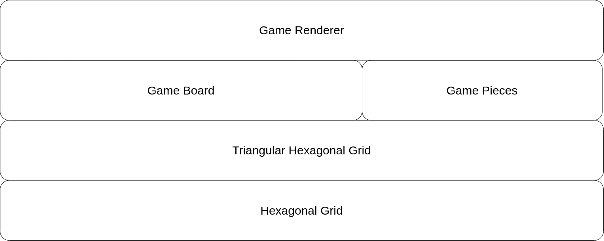
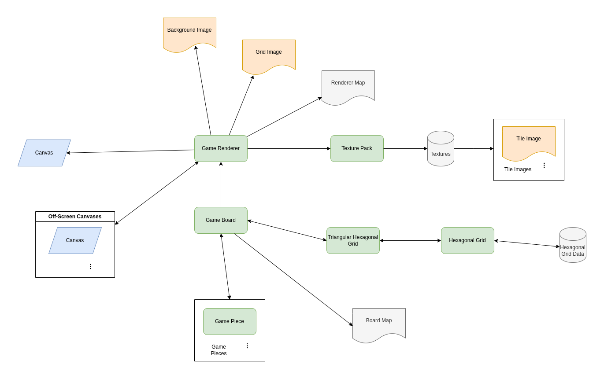

# Tridecco Game Board Architecture

## Table of Contents

- [Tridecco Game Board Architecture](#tridecco-game-board-architecture)
  - [Table of Contents](#table-of-contents)
  - [Overview](#overview)
    - [Architecture Layers](#architecture-layers)
    - [Structure Overview](#structure-overview)
  - [Core Grid Systems Layer](#core-grid-systems-layer)
    - [Hexagonal Grid (`HexGrid`)](#hexagonal-grid-hexgrid)
    - [Triangular Hexagonal Grid (`TriHexGrid`)](#triangular-hexagonal-grid-trihexgrid)
  - [Board Logic Layer](#board-logic-layer)
    - [Game Board (`Board`)](#game-board-board)
    - [Game Piece (`Piece`)](#game-piece-piece)
  - [Rendering Layer](#rendering-layer)
    - [Game Renderer (`Renderer`)](#game-renderer-renderer)
    - [Texture Pack (`TexturePack`)](#texture-pack-texturepack)
  - [Default Assets \& Maps](#default-assets--maps)
    - [Default Assets (Backgrounds, Grids, Textures)](#default-assets-backgrounds-grids-textures)
    - [Maps (`Board Map`, `Renderer Map`)](#maps-board-map-renderer-map)

## Overview

The Tridecco Game Board project is designed with a layered architecture, separating concerns for data management, board logic, and rendering. This separation allows for flexibility, maintainability, and extensibility of the codebase. The architecture can be broadly visualized in layers, starting from the fundamental grid system up to the user-facing rendering component.

### Architecture Layers

### Structure Overview

## Core Grid Systems Layer

This layer provides the foundational data structures for representing the game board's hexagonal grid.

### Hexagonal Grid (`HexGrid`)

- **Purpose:** At the base is the `HexGrid` class, which provides the fundamental data structure for managing a hexagonal grid. It uses offset coordinates to represent hexagonal cells and allows for storing and retrieving data at specific grid positions (column and row).
- **Responsibilities:**
  - Manages a 2D grid structure optimized for hexagonal layouts.
  - Supports different hexagonal grid types ('odd-r', 'even-r', 'odd-q', 'even-q').
  - Provides methods to `get`, `set`, `remove`, and `clear` values at grid coordinates.
  - Offers functionality to retrieve adjacent hexes (`getAdjacents`) based on the grid type.
  - Includes utility methods for iteration (`forEach`) and cloning (`clone`).
- **Data:** Stores the grid data in a 2D array structure.

### Triangular Hexagonal Grid (`TriHexGrid`)

- **Purpose:** The `TriHexGrid` class extends the `HexGrid` to introduce a finer level of granularity by dividing each hexagonal cell into six triangular sub-cells.
- **Responsibilities:**
  - Inherits all functionalities from `HexGrid`.
  - Manages data within each hexagon at a triangular level (1-6 triangles per hexagon).
  - Provides methods to `get`, `set`, and `remove` values for specific triangles within a hexagon using `(col, row, triangle)` coordinates.
  - Offers methods to manage data at a hexagon level, such as `getHexagon`, `setHexagon`, `removeHexagon`, and `isFull`.
  - Retains cloning and clearing capabilities from `HexGrid`.
- **Data:** Internally uses `HexGrid` to manage the hexagonal structure, and extends each hexagon's data to include a structure to store triangular data.

## Board Logic Layer

Built upon the grid systems, this layer implements the core board logic for the Tridecco game board.

### Game Board (`Board`)

- **Purpose:** The `Board` class represents the Tridecco game board itself, utilizing `TriHexGrid` as its underlying grid structure. It manages the placement of game pieces, tracks board state, and enforces game rules related to hexagon formation.
- **Responsibilities:**
  - Initializes the board based on a `Board Map` configuration, defining position indexes and relationships.
  - Manages an array of `Piece` objects placed on the board, indexed by position.
  - Provides methods to `get`, `set`, `place`, and `remove` `Piece` objects at specific positions.
  - Implements game logic for piece placement, including checking for occupied positions and identifying newly formed hexagons.
  - Tracks and manages "complete hexagons".
  - Provides functionalities for position management like `getRandomPosition`, `getEmptyPositions`, `getOccupiedPositions`, and `getAvailablePositions`.
  - Supports actions like undoing moves (`back`) and clearing the board (`clear`).
  - Implements an event system to notify external components about board actions (`set`, `remove`, `form`, `destroy`, `clear`).
- **Data:**
  - Uses a `TriHexGrid` instance to store the triangular hexagonal grid.
  - Stores an array (`indexes`) to track `Piece` objects placed at each position.
  - Maintains a `Set` (`hexagons`) of complete hexagon coordinates and a `Map` (`hexagonsColor`) to store their colors.
  - Keeps a history of actions for undo functionality.
  - Uses `Board Map` data for board layout and position information.

### Game Piece (`Piece`)

- **Purpose:** The `Piece` class represents individual game pieces used in the Tridecco game.
- **Responsibilities:**
  - Stores color information for each piece (typically two colors).
  - Provides a method (`equals`) to compare pieces based on their colors.
  - Can hold additional parameters or properties for piece variations.
- **Data:** Stores an array of `colors` (strings) and an optional `params` object for custom properties.

## Rendering Layer

This layer is responsible for the visual representation of the game board in a browser environment.

### Game Renderer (`Renderer`)

- **Purpose:** The `Renderer` class handles the visual rendering of the `Board` on an HTML5 canvas. It listens for events from the `Board` to update the visual representation in real-time.
- **Responsibilities:**
  - Manages an HTML5 `<canvas>` element and its 2D rendering context.
  - Utilizes off-screen canvases for efficient rendering and layering.
  - Loads and manages textures using the `TexturePack` class.
  - Renders the background, hexagonal grid, game pieces, and hexagon highlights.
  - Responds to `Board` events (`set`, `remove`, `form`, `destroy`, `clear`) to update the visual board state.
  - Provides functionalities for piece preview (`previewPiece`), highlighting available positions (`showAvailablePositions`), and clearing previews and highlights.
  - Supports updating the map, textures, background, and grid dynamically.
  - Manages event listeners for user interactions on the canvas (`dragover`, `drop`, `mousemove`, `click`, `resize`).
  - Implements a hitmap for efficient piece detection based on canvas coordinates.
- **Data:**
  - Utilizes `Renderer Map` data to determine tile and hexagon positions and dimensions for rendering.
  - Manages `TexturePack` instance to access texture assets.
  - Stores references to `HTMLImageElement` for background and grid images.
  - Uses multiple off-screen canvases for layering and rendering optimization.

### Texture Pack (`TexturePack`)

- **Purpose:** The `TexturePack` class is designed to manage and efficiently load texture assets (images) required for rendering game pieces and hexagons.
- **Responsibilities:**
  - Loads texture images based on a texture pack index file (`index.json`) typically located at a specified URL.
  - Organizes loaded textures by type (`tiles`, `hexagons`) and key.
  - Provides a method (`get`) to retrieve texture images by type and key.
  - Handles asynchronous loading of images and provides a callback mechanism to notify when loading is complete.
- **Data:** Stores loaded `HTMLImageElement` textures in `Map` data structures, categorized by `tiles` and `hexagons`.

## Default Assets & Maps

The project includes default assets and maps to facilitate quick setup and testing of the game board.

### Default Assets (Backgrounds, Grids, Textures)

- **Purpose:** Provides a set of default visual assets for the game board, including background images, grid designs, and basic piece textures.
- **Responsibilities:**
  - Offers a range of visually distinct background images for board customization.
  - Includes default grid designs for clear hexagonal grid visualization.
  - Provides a basic texture pack for game pieces, ensuring a functional visual representation out-of-the-box.
  - Assets are designed to be customizable and replaceable, allowing for easy visual theme changes.
- **Data:** Consists of image files for backgrounds, grids, and textures, organized in the `assets/` directory.

### Maps (`Board Map`, `Renderer Map`)

- **Purpose:** Map configurations define the layout and properties of the game board and its rendering.
  - **Board Map:** (`default.js` in `maps/board`) Defines the logical structure of the game board, including position coordinates, adjacency information, and grid type. Used by the `Board` class.
  - **Renderer Map:** (`default.js` in `maps/renderer`) Defines parameters specifically for rendering the board, such as tile and hexagon positions, dimensions, and canvas scaling factors. Used by the `Renderer` class.
- **Responsibilities:**
  - `Board Map`: Configures the `Board` class with layout-specific data, independent of rendering details.
  - `Renderer Map`: Configures the `Renderer` class with visual layout data, mapping logical board positions to canvas coordinates and dimensions.
- **Data:** JSON-like JavaScript objects defining map parameters and configurations.
